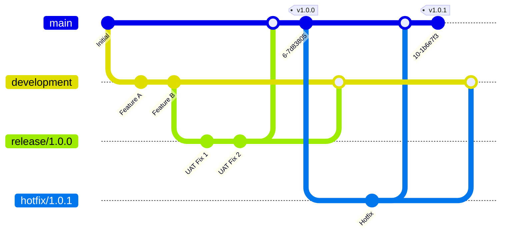

# bsnmw-ace

```mermaid
gitGraph
    commit id: "Initial"

    branch development
    checkout development

    commit id: "Feature A"
    commit id: "Feature B"

    branch release/1.0.0
    checkout release/1.0.0

    commit id: "UAT Fix 1"
    commit id: "UAT Fix 2"

    checkout main
    merge release/1.0.0
    commit tag: "v1.0.0"

    checkout development
    merge release/1.0.0

    checkout main
    branch hotfix/1.0.1

    checkout hotfix/1.0.1
    commit id: "Hotfix"

    checkout main
    merge hotfix/1.0.1
    commit tag: "v1.0.1"

    checkout development
    merge hotfix/1.0.1
```
